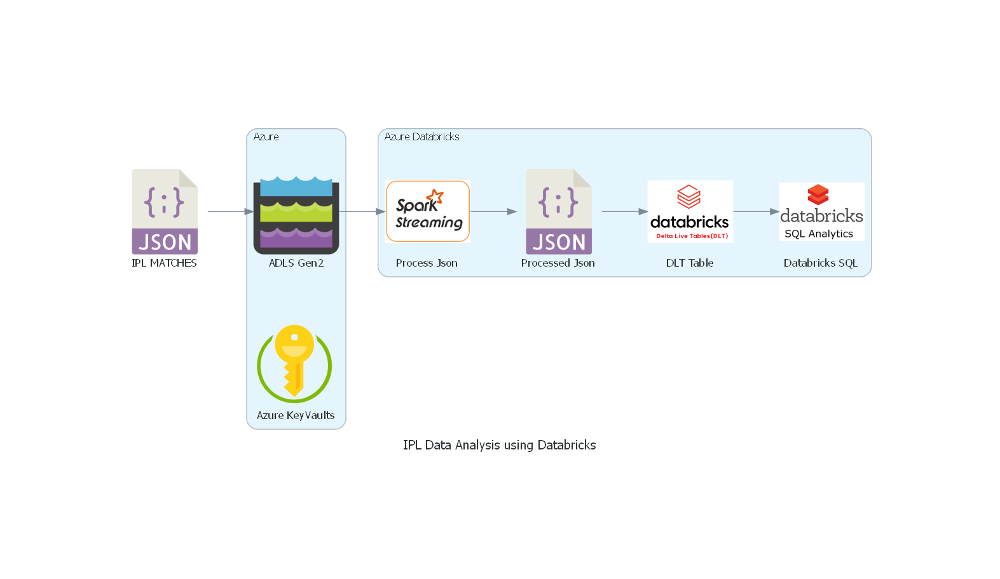

# IPL Analysis using Azure Databricks

## Project Description

This project aims to analyze Indian Premier League (IPL) data using Azure Databricks. The project leverages the power of Apache Spark, a fast and general-purpose cluster computing system, to analyze large datasets.

## Architecture Diagram

The architecture diagram above depicts the flow of data in the project. The IPL data is sourced from https://cricsheet.org/downloads/. The data is then ingested into Azure Blob Storage, which serves as a data lake. Azure Databricks is used to read and process the data, and the results of the analysis are stored in Azure SQL Database.

## Getting Started

### Prerequisites

### Installing

### Running the tests

## Usage

Azure Databricks is used to process the IPL data. The data is read from Azure Blob Storage, and processed using Spark streaming DataFrames. Various analyses are performed on the data, including but not limited to:

- Top batsmen and bowlers of the tournament
- Team-wise and player-wise statistics
- Analysis of player performance in various scenarios

The results of the analysis are stored in delta tables, and are visualized using databricks visualization. Interactive dashboards are created to display the results of the analysis.

## Contributing

## License

## Acknowledgments

## Contact Information

## Project Status
